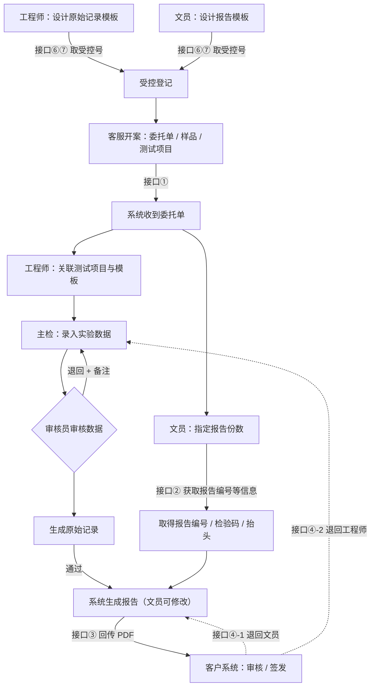
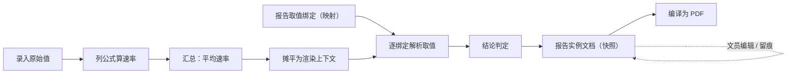

# 化学部检测报告系统 — 整体方案、对接接口与交付边界说明

> 本文档分三部分：**一、整体方案**（系统如何运转 + 设计思路 + 架构 + 可扩展性 + 服务器资源）；**二、对接接口说明**（需与客户系统对接的接口）；**三、需求边界**（本期交付内容清单，用于到期验收核对）。
>

---

# 第一部分　整体方案

## 1.1 系统定位

过去一份报告靠"手填 Excel + 手抄 Word"，慢、易错、效率低。

本系统把它变成一条**数字化流水线**：每个工位有专人负责一段（设计模板 → 录数据 → 审核 → 出报告 → 交付），**每段都自动留底**——什么时候、谁、改了什么，全部可查、不可篡改。最终产出是一份**印刷级的 PDF 报告**。

核心概念：
- **模板**：报告/记录的"空白表格母版"，规定要填哪些格子、单位是什么、哪些能自动算。
- **录入**：实验员往母版里填数据。
- **报告生成**：系统按预先配好的"对应关系"，把数据自动搬到报告对应位置，再排版成 PDF。
- **溯源**：每一步自动存档 + 记账，事后可完整回放。

## 1.2 角色与分工

| 角色 | 职责 | 主要界面 |
|---|---|---|
| **管理员**（系统 / 权限管理）| 维护系统内用户与角色、配置各角色可见菜单与可执行动作 | 权限管理后台 |
| **工程师**（模板编辑者）| 设计原始记录模板、配置公式；为测试项目关联模板 | 模板编辑器 / 录入工作台 |
| **文员**（报告模板编辑者）| 设计报告模板、配置取值映射；生成与精修报告、对外发送、处理退回 | 报告模板编辑器 / 报告工作台 |
| **主检 / 实验员**（tester）| 录入实验数据、被退回时修改 | 录入工作台 |
| **审核员**（reviewer）| 审核录入数据与模板改动，不对则退回 | 录入工作台（审核）|
| **客户系统**（外部）| 上游开案、提供报告抬头信息、接收 PDF、审核签发 | 通过接口对接 |

> **权限管理：身份借用客户、权限本系统自管（新增，需与化学部对齐）**
> - **登录沿用客户原有登录接口**（接口⑤）做身份认证——"**这个人是谁**"由客户系统校验；但"**这个人能做什么**"由**本系统内部的权限模块**决定，不依赖客户系统返回角色。
> - 本系统内置一套**基于角色的权限管理（RBAC）**：管理员在权限后台维护"用户 → 角色 → 功能权限"映射；**新用户首次登录后，须由管理员配置 / 指派权限**才能进入对应工作台。
> - 角色清单与权限粒度（每个角色可见哪些菜单、可执行哪些动作）**待与化学部对齐**后定稿。
> - 所有写操作的"操作人"仍统一从登录身份带入，用于留痕与权限校验。

## 1.3 全流程图

模板设计（原始记录模板、报告模板）是**先于具体订单**完成的——模板是可反复复用的母版；订单到来后才在母版里填数据、出报告。



说明：模板设计完成后先经**受控登记**（接口⑥⑦取受控号）才可用。客户开案、系统收到委托单（接口①）后**分两条线并行推进**：一条是**数据线**——工程师关联模板 → 主检录入 → 审核员审核（不通过则退回重录）；另一条是**报告准备线**——文员先**指定本单要出几份报告**，随即按份向客户取**报告编号 / 检验码 / 抬头**（接口②）。两条线汇合到**系统生成报告（文员可修改）**，再回传客户系统审核签发（接口③）。中途发现错可退回：报告问题退回文员、数据问题退回工程师（**接口拆为两路、退回对象待与化学部确认**）；即便已盖章签发仍可走退回接口再修改（开新版本、改编号、原版本保留、改动留痕，详见阶段 9–10）。全程留痕。

---

## 1.4 系统如何一步步运转

下面按流水线的每个阶段讲：**谁来做、在系统里怎么操作、技术上如何实现**。

### 阶段 1　模板设计（原始记录模板 + 报告模板）

模板设计在订单到来之前完成，分两部分。

#### 1A　工程师设计原始记录模板（含公式配置）

**谁来做**：工程师。

**怎么操作**：
1. 进入模板编辑器，**左侧拖拽**搭建表格：拖入分区（基本信息、试验环境、试验结果、结论、签字等）、往分区加字段（文本/数值/日期/单选/计算/图片/**数据矩阵**等），**右侧实时 PDF 预览**。
2. 设单位、是否必填，并**配置公式**：
   - **选内置公式**：平均、求和、最大、最小、阈值判定、范围判定、单位换算、百分比、文本拼接、中英映射、四舍五入等，勾选参与计算的列；
   - 或**写自定义表达式**：如"燃烧速率 = 距离 / 时间 × 60"。
3. 满意后「保存为草稿」→「提交审核」→ 由模板审核员**通过/退回**；审核通过后进入**受控环节**——把定稿模板送外部受控系统登记、取回**受控号 / 颁布日期 / 实施日期**（接口⑥⑦，详见阶段 6；外部不可用时支持手动录入应急），**到实施日期才正式生效可用**。

**⚙️ 技术实现**
- **公式如何实现**：自定义表达式走一个**安全沙箱**求值——**只解析四则与比较、绝不执行任意代码**，杜绝注入风险；字段间相互依赖时用**拓扑排序**先算被依赖项、再算依赖项，并做**循环依赖检测**防死循环；计算有固定顺序：矩阵单元格展平 → 单元格/列级公式 → 汇总行 → 汇总列 → 模板级计算字段。**录入端实时计算与出报告端渲染计算用同一套引擎与顺序，保证两边结果逐位一致**。
- **版本管理 — 核心思路**：一句话——**把"模板的身份"和"模板的每一次修改"分开存**。模板是一个稳定的身份（一个编号 + 名字 + 一个"当前生效版本"指针）；它的每一次修改都是一条**独立的、永不覆盖的版本记录**。如同文档的"修订历史"：文件名不变，但每次改动都留一条可回看的记录。围绕这一思想，回答几个常见问题：

  1. **一个模板对应"多条"修改记录（一对多），不是一条**：每改一次内容就在"版本表"里**追加一行**，一个模板随时间会有 v1、v2、v3… 多行；每行都存该版完整内容快照、版本号、状态、作者、审核人、改动摘要、**与上一版的逐字段差异（改了哪里）**、时间。所以"改了哪里"不是另存一处，而是每条版本记录自带。
  2. **修改再多也不卡**：版本表按"模板编号 + 版本号"建索引，查某模板的版本历史只命中它自己那几行（走索引、毫秒级，不扫全表）；模板列表只读名称/状态/当前版本号等小字段，**不读体积大的内容快照**，点开某一版才加载完整内容（懒加载）。量级参考：5000 模板 × 平均 20 版 ≈ 10 万行版本、约 2GB，单台数据库轻松支撑；单模板版本数通常只有几个到几十个。
  3. **派生（母子模板）怎么存**：子模板派生时把母版当时那一版内容**复制一份**成自己的独立版本，同时记下两个指针——父模板、父版本。**关系本身不单独建一张大表**，而是每个子模板存一个"父模板指针"（自引用），整棵族谱由这些指针隐式构成。
  4. **改一个模板绝不影响其他模板**：因为派生是"**按值复制、各自独立演进**"——改子模板只动它自己的版本表，完全不碰母模板，反之亦然。父指针只用来"显示血缘"，不用来"共享内容"。
  5. **派生关系再多也不卡**：父模板指针建索引，查族谱用数据库"**递归查询**"沿指针一次性展开整棵树；实际族谱通常又浅又窄（一个母版派生少数子版），递归层数少，即便几万模板单棵树节点也有限，查询毫秒级。
  6. **前端怎么显示才不错乱**：模板列表里**每个模板独立成一行平铺显示**（不把母子嵌套堆在一起），列表始终清爽；行内用一个可点击的"派生自 ××"标注血缘。想看血缘时，在该模板的「派生关系」面板里**单独展示一棵树**（上溯祖先、下展后代），点节点可跳到对应模板。即——**日常浏览用平铺列表互不干扰；要追血缘时单独打开一棵清晰的树**，两种视图分开，避免混在一起造成混乱。

- **版本管理（机制详解）**：原始记录模板与报告模板**使用同一套版本机制**。
  - **什么时候产生版本**：改字段定义、矩阵、公式、版式等"内容"会产生一个**新版本**；只改名称等元数据则不产生版本、即时生效。
  - **版本里存了什么**：每个版本是一行只追加的记录，含——该版完整内容快照、版本号、状态、作者、审核人、改动摘要、与上一版的字段级差异、时间戳。
  - **版本号递增**：同一模板的版本号从 1 起逐版 +1，永不复用。
  - **状态机**：

    ```mermaid
    stateDiagram-v2
      [*] --> 草稿: 编辑内容
      草稿 --> 待审核: 提交审核
      待审核 --> 已退回: 审核退回（须填备注）
      已退回 --> 草稿: 作者修改后再提交
      待审核 --> 待受控: 审核通过
      待受控 --> 已生效: 取回受控号 / 到实施日期
      已生效 --> 已归档: 被更新版本取代
    ```

  - **"当前生效版本"指针**：模板主表只存元数据 + 一个指向"当前生效版本"的指针；**所有读取都关联到这一版**，保证大家用到的永远是同一个权威版本。
  - **受控环节（新增，原始记录模板与报告模板一致）**：审核通过不等于立即可用，中间多一道"受控"——把定稿版本送外部受控系统登记，取回**受控号 / 颁布日期 / 实施日期**存进该版本；**到实施日期才翻成"已生效"**。受控号等随版本一起留痕、印到模板生成的文档上。外部受控系统不可用时，支持由有权限的人**手动录入受控号 / 颁布日期 / 实施日期**作应急，事后与外部对账。（受控机制与接口详见阶段 6 / 接口⑥⑦）
  - **生效是原子事务**：受控完成、到实施日期时，在一个数据库事务里完成"旧的已生效版 → 已归档、新版 → 已生效、主表指针翻到新版"，三步要么全成、要么全不动，杜绝中间态。
  - **草稿与防冲突**：同一模板同时只保留一个"未定版本"（草稿/待审核/已退回），避免多人各改一份造成混乱；改草稿不影响当前生效版。
  - **审核约束**：作者本人不能审自己的草稿；退回必须填备注；同一版本不重复审核。
  - **看历史 / 比差异 / 回退**：可查看任意历史版本的完整内容、比较任意两版的字段级差异；因为**老版本永不删除**，需要"回退"时可基于某历史版本重新生成新版本，且全程留痕。
  - **与录入数据的关系（合规关键）**：每条录入数据记下"录入当时所用的模板版本号"，出报告按该版本回放——工程师之后改模板，**不会改变历史数据/历史报告的呈现**。
- **派生（母子模板）**：可从某模板某版本复制出一个新模板，并记下父模板/父版本；查看族谱时用数据库"递归查询"一次性拉出整棵树，既便于复用相似模板，又能追到"这个模板从哪个改出来的"。

#### 1B　文员设计报告模板（含取值映射配置）

**谁来做**：文员。

**怎么操作**：
1. 进入报告模板编辑器，分"**首页模板**"和"**项目模板**"两类，搭建报告版式（抬头、结论汇总表、检测结果表、设备表、图片表、签字区等）。
2. **配置取值映射**：给报告上每个空格"贴标签"，说明它的值从哪来——可以是固定文字、原始记录某字段、数据矩阵某格、某汇总值、公式结果、主检/审核签字、委托单信息等。
3. 设备表、图片表设为**自动汇集**：无需逐格配，出报告时系统自动从关联的原始记录里抓设备编号、图片拼成表。
4. 同样走"草稿 → 审核 → **受控** → 生效"的版本流程（受控环节与原始记录模板完全一致，详见阶段 6 / 接口⑥⑦）。

**⚙️ 技术实现（映射怎么配、怎么实现）**
- **统一的"取值绑定"模型**：每个空格的来源用一个带"来源类型"的结构描述，目前支持 **8 种来源**：

  | 来源类型 | 取什么 | 需要的参数 |
  |---|---|---|
  | 固定文字 | 写死的文本 | 文本内容 |
  | 记录字段 | 原始记录某个普通字段 | 字段编码 |
  | 矩阵单元格 | 数据矩阵某一格 | 矩阵编码 + 样品序号 + 参数编码 |
  | 汇总值 | 矩阵某行/列的汇总 | 矩阵编码 + 汇总项 |
  | 公式结果 | 现算一个公式 | 公式定义 |
  | 签字信息 | 主检/审核/检测日期 | 取哪一项 |
  | 委托单信息 | 单号/客户/样品名/收样日期 | 取哪一项 |
  | 系统信息 | 今天/当前时间 | 取哪一项 |

- **怎么配**：在报告模板的"检测结果表画布"里，每个格子点开选择器，选来源类型并填参数（如"取燃烧矩阵第 1 个样品的速率列"），全程可视化点选，绑定随报告模板一起版本化保存。
- **怎么实现取值**：出报告时把该项目的原始记录数据"摊平"成一个可直接查的扁平字典，连同签字、委托单信息组成"渲染上下文"；再对每个绑定调"解析器"，按来源类型取出实际值填进对应空格。
- **设备表/图片表自动汇集**：渲染时扫描关联记录里所有"设备引用""图片"字段，自动抓取拼表，无需逐格绑定。
- （关于"录入时增减样品导致结果表行数变化"的进一步优化，已另有动态展开方案。）

#### 模板在系统里怎么存、为什么能反复复用、怎么被拉取

- **存储方式**：模板以"**分组 → 字段**"的结构化文档（JSON）存在数据库里，**与任何具体订单、任何具体实验数据完全分离**。模板是"母版"，数据是"填进母版的内容"，两者解耦存放。
- **为什么这样做**：母版与数据分离后——改母版不动历史数据，改数据不动母版；同一母版可被**任意多张订单、任意多次实验复用**，无需为每单复制一份模板。
- **为什么对每个订单都能复用**：模板本身**不绑定任何订单**。订单录入时只"引用"模板的某个**版本号**；出报告时按这个版本号去取母版结构来填充。换一批数据、出另一份报告，模板与映射规则原封不动。
- **怎么被拉取（保证快）**：列表页只读模板的**元数据**（名称、状态、当前版本号），**不读体积大的字段定义**，所以即便模板成千上万也能秒开；打开某个模板时才**按需**拉取其当前版本的完整内容；历史版本**懒加载**（点开版本历史时才查）。这套"列表只取元数据 + 内容按需加载 + 走索引"的做法是大规模下仍然流畅的关键（详见 1.6 可扩展性）。

#### 模板修改的三个连锁问题：母子联动 / 历史数据 / 映射一致性

模板上线后难免要改。改一个模板，会牵动三件事——**会不会连累母子模板？会不会改乱历史数据 / 报告？报告映射要不要重配？** 逐一说明设计如何处理。

**问题一：改一个模板，能不能同时改它的母模板 / 子模板里相应的字段？**

- **默认不联动（安全优先）**：派生是"按值复制、各自独立演进"（见 1A）。改子模板只动它自己、绝不碰母模板，反之亦然——`父模板指针`只用来"显示血缘"，不用来"共享内容"。这是合规底线：每个模板的每一次改动都要独立审核、独立留版本，不能被别处悄悄改掉。
- **可选"变更传播"（按需开启）**：确实需要"母版改了，下游一起改"时，提供一个**受控的变更传播**功能，而不是直接改别人：
  1. 在模板编辑器里改完某字段后，可勾选"把本次改动推送到选定的派生模板"（通常是母版 → 各子版，也支持反向）。
  2. 系统对每个目标模板**生成一个新草稿**，把同一处"字段级改动"套用上去——**不是直接生效，而是各自走"草稿 → 审核 → 生效"流程**。每个目标模板的审核人仍要把关，留痕、留版本一个都不少。
  3. 若某个目标模板早已在这个字段上"改出了不同"（冲突），系统标出冲突让人工决定，绝不盲目覆盖。
- **为什么这样设计**：既满足"一处改、多处同步"的便利，又守住"每个模板独立、改动必经审核、历史可回溯"的底线——传播的是"一份改动建议"，落地与否由各模板自己的审核说了算。

**问题二：模板改了，之前据此生成的报告 / 录入的原始数据要不要跟着改？不改会不会乱？**

- **不改，也不会乱**——靠的是"**版本锁定回放**"与"**报告是快照**"两条机制：
  - 每条原始数据录入时就**锁定了"当时那一版模板"**；出报告时按这一版的字段结构来解释数据。之后工程师把模板改成新版，**历史数据仍按旧版呈现与计算**，格式不会错乱。
  - 已生成的报告是**生成那一刻定格的快照**，模板后续怎么改都不影响它。
- **新旧分界**：模板改动**只对"改之后"新录入的数据、新生成的报告生效**；存量数据 / 报告留在各自的旧版本上。
- **要不要把老数据"迁移"到新格式？**——通常**不迁移**（检测行业要求历史原貌可复现）。确有需要时，属于一次显式的"数据迁移 / 重录"决定，由人工发起并审核，绝不自动批量改写。
- **注意区分"改模板" vs "改数据"**：这里说的是改模板。若是退回重录、**改了原始数据**，那确实会让引用旧数据的已出报告过期——那由"源数据已更新，建议重新生成"的失效标记处理（见阶段 10），与"改模板"是两回事，模板改动**不会**给历史报告打失效标记。

**问题三：原始记录模板改了，报告模板的取值映射要不要重新配置？**

- **多数情况不用重配**：映射靠**字段编码**（字段编码 / 矩阵编码 / 参数编码）来指向原始记录的字段。只要编码没变——新增字段、改标签、改单位、改公式——**老映射照样命中**，无需动报告模板。
- **只有动了编码才会出问题**：如果把某字段**改名（改编码）或删除**，而报告里有映射正指着它，这个映射就会**静默取空**（那一格变空且无告警）。这是要管理的重点。
- **怎么管理——映射引用完整性校验 + 反向影响提醒**：
  1. **保存 / 审核报告模板时校验**：拿"关联原始记录模板当前版本"的字段集，逐个核对报告里的映射；指不到的**编辑器标红 + 审核时告警**。
  2. **改原始记录模板时反向提醒**：当工程师要改名 / 删除某字段编码，提交前系统扫描所有"引用了该原始记录模板"的报告模板，提示"有 N 个报告模板的 M 处映射引用了即将改动的字段 X，将会失效"，并给出跳转链接。
  3. **编码重命名做成受控操作**：把字段编码当作稳定标识；重命名时可选择"自动更新所有引用它的报告映射"（对这些报告模板各生成草稿、走审核），或先拦下来要求人工修正。
  4. **历史报告不受影响**：因为报告是快照、且按数据锁定版本解释，**已生成的报告不会因此变化**；完整性校验针对的是"以后再用新版原始记录模板出的报告"。

> 一句话：**默认互不影响（靠版本锁定与快照），需要联动时走"建议草稿 + 各自审核"，映射一致性由"完整性校验 + 反向影响提醒"兜底。**（技术实现详见《待实现内容.md》第 8 节）

---

### 阶段 2　委托单进入系统

**谁来做**：客户客服开案后由客户系统推送（接口①），无需我方人工录入。

**做什么**：系统收到"有哪些委托单、每单哪些样品、每样品做哪些测试项目"，自动建好待办；实验与报告两端都能看到这些单子和进度。

**⚙️ 技术实现 / 为什么**：委托信息来自上游单一来源，避免重复录入与不一致。每个"样品 × 测试项目"是后续一切操作的最小单元（一条数据、一行报告都对应它）。

---

### 阶段 3　工程师把测试项目关联到原始记录模板

**谁来做**：工程师。

**怎么操作**：在录入工作台，为委托单里每个测试项目**搜索并关联**它该用哪个原始记录模板（如"燃烧特性"用燃烧记录模板）。

**⚙️ 技术实现 / 为什么**：关联只是建立"测试项目 → 模板"的指向关系，让录入时知道该用哪张母版；报告侧的映射在阶段 1B 已配好，此处不再涉及。一个模板可被多个订单的多个测试项目同时关联、互不影响。

---

### 阶段 4　主检录入实验数据

**谁来做**：主检 / 实验员。

**怎么操作**：
1. 进入录入工作台，看到自己单子下的样品和测试项目，点「录入」，系统按关联模板**自动生成录入表单**。
2. 填数据：普通字段直接填；**数据矩阵**（样品×参数的表格）按格填，已配公式的列**实时自动算**（填了基础数据，结果列即时算出）；可**上传图片**、**从 Excel 导入**批量填充。
3. "主检""检测日期"等字段系统自动带出、只读。
4. 「提交」后状态变"待审核"。

**⚙️ 技术实现**
- 一条录入记录存两部分：**原始填写值**与**派生/计算值**（都是 JSON 文档），同时记下"当时用的模板版本号"。
- **数据矩阵**结构 = {样品列表 + 参数列表 + 单元格字典}，每格用 `矩阵编码__样品编号__参数编码` 作键定位；底部可挂"汇总行/汇总列"。
- **按版本锁定回放（合规关键）**：以后哪怕工程师改了模板，这条历史数据仍按"录入当时那一版"显示与计算，不被改乱。
- 签字类字段不进原始数据，其权威值在记录的专用列里，渲染时再注入，避免冗余与不同步。

---

### 阶段 5　审核员审核数据

**谁来做**：审核员（**不能是本人**——做实验的人不能审自己的数据）。

**怎么操作**：在录入工作台看到"待审核"记录，点「审核」→ **通过**（可用于出报告）或 **退回**（必须填备注，主检改完重提、版本自动 +1）。

**⚙️ 技术实现**
- 记录有"审核状态"（待审核/已审核/已退回）+ 退回备注 + 当前版本号。
- 每个动作（提交/更新/审核/退回）都往**审计流水表**追加一行，含**当时的数据完整快照**、版本号、前后状态、操作人、备注——该表只增不改，是溯源核心账本。
- "本人不能审本人""退回必填备注""同一版本不重复审核"由后端强校验。

---

### 阶段 6　原始记录自动生成与受控（新增）

**谁来做**：系统自动生成；受控登记与外部受控系统协作，应急时由有权限的人手动录入受控号。

**怎么操作 / 做什么**：
1. **自动生成原始记录**：数据审核通过后，系统按"录入数据 + 该记录锁定的模板版本"**自动排版生成一份印刷级原始记录（PDF）**——与报告同一套排版引擎，所见即所得、可归档。
2. **原始记录受控**：把生成的原始记录 PDF 送外部受控系统登记（**接口⑥**），外部回传**受控号 / 颁布日期 / 实施日期**（**接口⑦**），印到原始记录上、随记录归档。
3. **应急方案**：外部受控系统不可用时，允许有权限的人**手动录入受控号 / 颁布日期 / 实施日期**，照常留痕，事后再与外部对账。

**⚙️ 技术实现 / 为什么**
- **为什么要自动生成原始记录**：原始记录是法律证据与受控文件，需要一份固定版式、可归档的正式文档；自动生成避免手抄、保证与录入数据逐位一致（复用报告的组装 / 渲染流水，按锁定版本回放）。
- **"受控"是什么**：检测行业要求模板、原始记录等文件"受控"——有唯一受控号、颁布日期、实施日期，未受控不得用于正式业务。本系统把"受控登记"做成一道环节：定稿 → 送外部受控系统 → 取回受控号等元数据 → 生效；受控元数据随对象一起留痕。
- **模板也走同一受控流程**（见阶段 1 / 3.4）：原始记录模板、报告模板审核通过后同样送受控、取回受控号，到实施日期才可用于生产；与本阶段的"原始记录受控"共用接口⑥⑦与手动应急通道。
- **接口**：本系统传 PDF（接口⑥，本系统 → 外部）、外部回传受控号（接口⑦，外部 → 本系统）；二者均提供**手动录入应急通道**。

---

### 阶段 7　文员定份数并生成检测报告（一单可出多份）

**谁来做**：文员。

**怎么操作**：
1. 进入报告委托单列表，看到每单的录入进度，并可**只读查看原始记录**（看得到、改不了）。
2. 进入某单的报告工作台，选「首页模板」和各项目的「项目模板」（系统按关联**自动推荐**）。
3. 选「出报告方式」——**整单一份 / 按样品 / 按项目 / 自由勾选**，**定好这一单要出几份报告**（一单可出多份）。
4. **定好份数后，系统按订单号 + 份数向客户取每份的报告编号 / 检验码 / 抬头信息（接口②）**——因为编号 / 检验码每份各一套，必须先定份数才能要号，故接口②的触发时机定在此处（而非外发时）。
5. 右侧实时预览，确认后「生成」。一张单产出的多份报告归为一个**批次**，每份有独立编号和范围。

**⚙️ 技术实现**
- **组装流水**：按委托单范围筛出已审核记录 → **按每条记录锁定的模板版本**取字段定义 → 摊平矩阵 → 跑公式 → 对每个绑定调解析器取值 → 首页 + 各项目拼成一份文档 → 注入接口②取回的报告编号 / 检验码 / 抬头 → 专用文档格式引擎**编译成 PDF**（相同源码有缓存、不重复编译）。
- **接口②触发时机（已调整）**：从"外发时取抬头"前移到"**文员定好份数时按份取号**"。因为报告编号 / 检验码每份各一套，需先知道份数与范围才能向客户要对应的编号数组（对齐接口②方案 A）。
- **四种出报告方式的本质**：把"样品×项目"格子按规则分组，每组生成一份报告，多份归入一个批次。
- **冻结成"实例文档"**：生成那一刻把"报告结构 + 已解析的数据 + 接口②元数据"打包成一份**自包含快照**存库，与模板/原始数据解耦——既是存档，也是下一步可编辑的对象。生成与"编辑后重渲染"复用同一条组装代码，保证口径一致。

---

### 阶段 8　文员精修报告（逐字段编辑 + 留痕 + 偏离提醒）

**谁来做**：文员。

**怎么操作**：
1. 进入报告结构化编辑界面：报告变成一份"能逐格修改的表单"。
2. 可**直接改任意字段值、增删字段、给结果表加/删行、改单元格**；右侧实时预览，「保存」。
3. 改的值与原始记录不一致时，系统**自动标红**并提示"偏离原始数据 X 处"、显示原始值。
4. 点「编辑历史」可看这份报告每一次改动：谁、何时、把哪个字段从什么改成了什么。

**⚙️ 技术实现**
- **编辑的本质**：改一个值 = 把该格的"绑定"从"取自数据"改成"固定文字（用户输入的新值）"；增删字段/行 = 直接改实例文档结构。**所有改动只落在这份实例文档上，绝不写回原始记录数据**（原始数据是法律证据，只能在录入侧由主检改、再走审核）。
- **重渲染**：用与生成时同一条组装路径重新编译，保证版式一致。
- **留痕**：保存时把"改前 vs 改后"实例文档各自摊平成"字段→值"，逐项比对得出"哪个字段从 X 改成 Y / 新增 / 删除"，连同操作人写进报告审计流水。
- **偏离告警**：生成时额外存一份"原始快照（不可变基线）"，编辑器实时把"当前值"与"原始值"逐字段比对、标红。

---

### 阶段 9　报告外发与客户审核（含盖章后再修改）

**谁来做**：文员触发，系统与客户系统通过接口协作。

**流程**：
1. 报告编号 / 检验码 / 抬头**已在阶段 7（文员定份数）时通过接口②取回并印入页眉页脚**，本阶段不再重复取。
2. 系统把生成的 PDF 回传客户系统（**接口③**）。
3. 客户系统里相关人员审核、签发、盖章。
4. **盖章后仍需修改（新增）**：报告已签发盖章后若发现还要改，**复用"审核前退回"的接口（接口④）**触发退回，文员据此修改——见下方"盖章后修改"的版本处理。

**⚙️ 技术实现 / 为什么**
- 抬头/编号/检验码等"机构权威信息"由客户系统统一管理，我方只按规则填进 PDF，避免编号冲突或口径不一。
- **页眉页脚**由排版主题统一生成：专用文档格式引擎原生支持**运行页眉页脚**（每页重复）、**首页与其余页不同**（如首页报告编号 vs 其余页编号）、**页码/总页数**；抬头数据来自接口②，注入主题配置后渲染。
- 多份报告**按份回传**、各带编号（详见第二部分接口③）。
- **盖章后修改的版本处理（新增）**：
  - 触发后报告进入一个**新版本、状态为"草稿"**；**原签发版本仍完整保留**（不可删），形成报告自身的版本链。
  - **报告编号会变更**（改版需换号，由接口②按新一份重新取号或追加版本后缀，具体规则待与化学部对齐）。
  - 必须保存**修改时间 / 修改文员 / 修改信息备注**（写入报告审计流水），与既有"字段级 diff + 偏离告警"一起留痕。
  - **保留 PDF 还是原始（实例）数据？——建议两者都留，以实例文档为准（待确认）**：保留**报告实例文档（结构化快照）**作为可重新渲染、可继续编辑的权威副本；同时**归档已签发的那版 PDF**作为法律留存件。这样既能按需重渲染出一致版面，又留住盖章原件。最终取舍**待与化学部确认**。
  - 修改完成后重新生成 / 精修 → 重新经客户审核签发（回到本阶段）。

---

### 阶段 10　发现错误怎么退回修改

任何一关发现错都能退回上游重做、且留痕。四种情况：
1. **文员出报告时发现原始记录有错** → 退回录入：主检改 → 重审 → 文员重新生成报告。
2. **审核员审数据时发现错**（已实现）→ 退回录入：主检改 → 重审。
3. **客户审核后要求修改** → 按问题性质走**两路退回接口（新增，退回对象待与化学部确认）**：
   - **接口④-1 退回文员**（报告呈现 / 排版问题）→ 文员在报告编辑器改 → 重发。
   - **接口④-2 退回工程师 / 主检**（原始记录 / 数据问题）→ 改数据 → 重审 → 文员重生成。
   - 究竟"报告有误退回工程师还是文员"**待与化学部确认**；系统按确认结果把接口④拆为上述两路（也可由文员收单后自行分级升级，二选一同样待确认）。
4. **报告已盖章签发后仍需修改**（新增）→ **复用接口④**触发退回 → 报告开新版本（草稿、改编号），原版本保留、改动留痕（详见阶段 9）。

**设计原则：分级处理 + 共享可见**——每一步只有一个责任人，数据改动必走审核，避免并行冲突；相关人员都能看到"这单有退回在处理"。每次退回与修改都记账。

**⚙️ "工单"是什么样的**
- 退回被记成一条"**返工工单**"——本质就是数据库里的一行记录，字段包括：所属订单号、范围（针对某条记录 / 某份报告）、从哪个阶段退到哪个阶段、提出人、退回原因/修改建议、状态（待处理/处理中/已解决）、处理人、以及"升级"时的父工单指向。
- 工单只表达"**退到哪、为什么**"；"**具体改了什么**"复用阶段 5、阶段 8 的两套审计流水，按订单号关联。
- 数据被改后，引用旧版本的已生成报告会被标记"**源数据已更新，建议重新生成**"，保证退回闭环一致。

---

### 贯穿全程　溯源：任何时候都能查"谁改了什么"

系统在每个环节自动留底，事后可完整回放。溯源不是单独一个功能，而是由几张相互关联的"账本"共同支撑。

**(1) 四类溯源账本，各记什么**

| 账本 | 记录对象 | 每条记下什么 |
|---|---|---|
| **录入审计流水** | 实验数据 | 动作（提交/修改/审核/退回）、操作人、版本号、**当时的数据完整快照**、前后状态、退回备注、时间 |
| **报告审计流水** | 报告 | 动作（生成/编辑）、操作人、**字段级差异（哪个字段从 X 改成 Y / 新增 / 删除）**、时间 |
| **模板版本表** | 模板 | 每一版的内容快照、作者、审核人、改动摘要、与上一版差异、状态、时间 |
| **派生族谱** | 模板间关系 | 谁从谁派生而来（父模板/父版本）|

**(2) 三个关键设计**
- **只增不改**：所有账本都是**追加新行、绝不覆盖旧行**——历史从机制上不可篡改。
- **带快照与差异**：审计不仅记"改过"，还记"**当时长什么样**"（数据快照）和"**具体改了哪一处**"（字段级差异），所以能精确回放任意时刻的状态。
- **走索引、分页、按需展开**：账本按订单号/记录号/报告号建索引，查某单某记录走索引、分页加载；体积大的快照只在点开某条时才展开，不会一次拉回海量数据（这也是规模化后仍流畅的关键，见 1.6）。

**(3) 举例：如何溯源一份报告（反查整条链）**

任取一份已交付的报告，可以一路反查到底：
1. 这份报告由**哪些实验记录**汇集而来 → 每条记录的**录入与审核流水**（谁录的、谁审的、中途退回过几次、每次数据是什么）；
2. 每条记录**锁定的是模板的哪一版** → 那一版模板**由谁设计、谁审核通过**；
3. 这份报告本身的**生成与每一次编辑**（谁、何时、把哪个字段从什么改成什么）；
4. 报告里**与原始数据不一致之处**（偏离告警标红项）一目了然。

→ 形成一条"**从最终报告，倒推回每一个数据、每一版模板、每一个经手人**"的完整证据链。

**(4) 统一时间线（设计完成）**：把上述账本按订单号、按时间合并成一条总链路，在订单/报告页用时间线直接呈现"自始至终发生了什么"。

> 这套"只增不改 + 全程快照 + 可反查"的留底机制，满足检测行业（GxP / ISO 等）对"**可追溯、可审计、数据不可篡改**"的合规要求。

---

### 综合示例：一个测量值如何从录入一路走到报告

用一个真实例子把"数据矩阵 → 公式 → 映射 → 报告"串起来。

**场景**：燃烧特性试验，3 个样品（1#/2#/3#），每个测"燃烧距离(mm)""燃烧时间(s)"，算"燃烧速率(mm/min)"，取平均，判定合格与否。

**① 设计模板（阶段 1）**：燃烧矩阵列 = `距离`、`时间`、`速率`；"速率"列配公式 `距离/时间×60`；底部汇总"平均速率"；报告结果表把"平均速率"格**绑定**到该汇总值，"结论"格配阈值判定（≤100→合格）。

**② 主检录入（阶段 4）**——只填灰底两列，其余自动算：

| 样品 | 距离(mm) | 时间(s) | 速率＝距离/时间×60 |
|---|---|---|---|
| 1# | 95 | 60 | **95.0**（自动）|
| 2# | 102 | 60 | **102.0**（自动）|
| 3# | 88 | 55 | **96.0**（自动）|
| | | **平均** | **97.7**（自动）|

**③ 数据在系统内部如何变化**

| 步骤 | 数据形态 |
|---|---|
| 录入原始值 | `{ burn__1#__dist: 95, burn__1#__time: 60, … }` |
| 跑列公式 | 追加 `burn__1#__rate: 95.0`、`burn__2#__rate: 102.0` … |
| 跑汇总 | 追加 `burn__avg_rate: 97.7` |
| 摊平为渲染上下文 | 一个可直接查的扁平字典（上面所有键值）+ 签字/委托单信息 |

**④ 出报告（阶段 7）**：对结果表每个绑定调解析器——"平均速率"格取 `burn__avg_rate` = 97.7；"结论"格判定 97.7≤100 = "合格"；填进报告 → 编译 PDF。

**⑤ 留痕/偏离（阶段 8）**：若文员把某格从 97.7 手改成 98.0，系统对比原始快照、把该格标红"原始值 97.7"，并记一笔"谁把平均速率从 97.7 改成 98.0"。



> 关键点：**①公式在"录入"和"出报告"两端用同一套引擎与顺序，两边结果逐位一致**；**②映射只描述"从哪取"，真正取值在出报告时发生**，所以同一套报告模板能套用任意一批实验数据。

---

## 1.5 核心设计原则

1. **模板只增不改、改动要审批、受控后生效**——任何一版都能回看；审批通过后还须**受控登记**（取得受控号 / 颁布日期 / 实施日期）才正式可用。
2. **历史数据按"当时那一版"回放**——以后改模板，不会把老记录/老报告改乱。
3. **报告是"快照"**——生成那一刻定格，之后改东西不影响已出的报告（除非重新生成）。
4. **原始数据永不被报告改写**——报告侧只做呈现层修改，数据对错只在录入侧改并重新审核。
5. **改动全程留痕 + 偏离告警**——谁、何时、把什么从 X 改成 Y，并对偏离原始数据处标红；**报告即便盖章签发后再改，也开新版本、原件保留、改动留痕**。
6. **退回分级、单一责任**——每一步一个责任人，数据改动必经审核，避免并行冲突。
7. **映射一次配好、自动搬运**——报告与数据的对应关系预先配置，出报告时自动填充。
8. **受控贯穿模板与原始记录**——模板、原始记录均为受控文件，统一走"送外部受控系统登记 → 取回受控号 → 生效"，外部不可用时支持手动应急录入。
9. **身份借用客户、权限本系统自管**——登录沿用客户接口认证身份，可执行哪些操作由本系统内置 RBAC 决定，管理员配置（详见 1.2）。

---

## 1.6 可扩展性与性能

> 关注三类增长：模板越来越多、溯源/修改记录越来越多、报告渲染越来越频繁。设计上各有对策，保证规模化后仍稳定流畅、不致系统崩溃。

### (1) 模板规模（几千到几万个模板）
- **列表只取元数据**：模板列表只查名称/状态/版本号等小字段，**不查体积大的字段定义**，所以列表打开始终很快。
- **内容按需加载 + 走索引**：打开某模板才拉它当前版本的完整内容；历史版本懒加载（点开才查）；版本表按"模板编号 + 版本号"建索引，单次查询走索引、毫秒级。
- **容量估算**：以 5000 个模板、平均每个 20 个版本计 ≈ 10 万行版本记录，JSONB 约 2 GB——对单台 PostgreSQL 是很轻的量；增长到数万模板仍可通过索引 + 分页平稳支撑，必要时加只读副本分担查询。

### (2) 溯源/修改记录规模（审计流水持续增长）
- 审计流水**只增不改**、按订单号/记录号/报告号建索引；查看某单/某记录的溯源时**走索引 + 分页加载**，不做全表扫描，因此"记录再多，查单条溯源也不会变慢"。
- 大字段（数据快照 JSONB）不进列表查询、只在点开某条时按需展开，避免一次拉回海量数据拖垮页面或服务。
- 长期增长可对历史审计做**按时间分区/冷数据归档**（运维层面，不影响业务）。

### (3) 报告渲染（高并发出报告/预览）
- 相同源码**缓存**不重复编译；渲染是 CPU 密集型且**无状态**，可**横向加渲染节点**线性扩容；高峰用**任务排队**削峰，避免瞬时洪峰压垮服务。
- 渲染与在线交互**资源隔离**（独立节点/进程），保证"有人在批量出报告"时，别人的录入/浏览不卡。

### (4) 不崩溃的总体措施
- 大字段不进列表查询、一律分页；关键查询全部走索引；图片附件放对象存储而非数据库；应用层无状态、可多实例 + 负载均衡；数据库可加只读副本；渲染节点可弹性增减。

---

## 1.7 系统架构

```
                         ┌──────────────────────────────────────────────┐
                         │              客户既有系统                      │
                         │  开案/委托管理 · 报告基础信息 · 审批签发 · 登录    │
                         └───┬───────────▲───────────▲──────────┬───────┘
            接口① 委托单推送   │           │ 接口② 抬头 │ 接口③ PDF │ 接口⑤ 登录
            接口④ 退回修改     ▼           │           │回传        ▼
   ┌───────────────────────────────────────────────────────────────────────┐
   │                         本系统（检测报告平台）                            │
   │                                                                       │
   │   前端（网页界面）          后端（业务逻辑）          排版渲染               │
   │  ┌───────────────┐      ┌──────────────────┐   ┌──────────────────┐   │
   │  │ 模板编辑器     │       │ 模板/版本管理      │   │专用文档格式排版引擎 │   │
   │  │ 录入表单       │◀────▶ │ 录入/审核流       │──▶│   → 印刷级 PDF    │   │
   │  │ 报告工作台     │  网络  │ 报告生成/批次     │    └──────────────────┘   │
   │  │ 报告编辑器     │       │ 审计/溯源 · 接口适配层 │                       │
   │  └───────────────┘       └─────────┬────────┘                          │
   │             ┌───────────────────────┼───────────────────┐              │
   │             ▼                       ▼                   ▼              │
   │       数据库                  对象存储                缓存/队列(可选)      │
   │   模板/版本/录入/报告/审计       图片/附件              渲染任务排队         │
   └───────────────────────────────────────────────────────────────────────┘
```

三层职责：
- **前端（网页界面）**：用户用浏览器看到、操作的所有页面。
- **后端（业务逻辑）**：处理规则、流程、**权限（内置 RBAC，见 1.2）**、留痕，是系统中枢。
- **排版渲染**：把填好的数据编译成印刷级 PDF（报告与原始记录共用）。
- **数据库**：模板、数据、报告、审计记录的唯一存放处。

> **图外补充（本次新增的对外协作）**：
> - 除"客户既有系统"外，还对接一个**外部受控系统**：模板与原始记录定稿后送其登记，取回受控号 / 颁布日期 / 实施日期（**接口⑥本系统传 PDF、接口⑦外部回传受控号**，均带手动应急通道）。
> - **接口④"退回修改"拆为两路**：退回文员（报告问题）/ 退回工程师（数据问题），退回对象待与化学部确认；盖章后再修改也复用接口④。
> - 接口②"报告抬头/编号"的取号时机前移到"文员定好份数时"（见阶段 7）。

## 1.8 技术栈

| 层 | 技术 | 说明 |
|---|---|---|
| 前端 | React + Vite + Ant Design（网页应用）| 拖拽编辑、表单、实时预览界面 |
| 后端 | Node.js + TypeScript（RESTful 接口）| 业务规则、版本/审核流、报告组装、对外接口 |
| 数据库 | PostgreSQL | 既存规整数据，也存灵活文档结构（JSONB），稳定可靠 |
| 排版渲染 | **专用文档格式的声明式排版引擎** | 用源码精确控制版面（页眉页脚、表格、字体、分页），输出印刷级 PDF |

## 1.9 服务器资源估算（约 500 并发）

> 前提假设：峰值 **500 人同时在线**（实际约 400，含冗余）；日常以浏览/录入/编辑等轻操作为主，伴随突发的报告渲染（吃 CPU）。以下为工程估算，**上线前建议用真实模板/数据压测校准**。

**先解释两个名词**
- **vCPU（虚拟 CPU 核心）**：云服务器上的一个逻辑处理核心。"4 vCPU"≈ 4 个核心可并行干活；核心越多，能同时处理的请求/渲染越多。
- **GB（内存）**：服务器内存大小；内存越大，能同时缓存的数据、能并行的进程越多。

**估算过程（怎么算出来的）**

1. **轻请求（看页面、录数据、保存、审核）**：这类是绝大多数操作，单个 Node 进程每秒可处理数千次轻请求。500 人即便频繁点击，每秒请求量也远低于单进程上限——因此 **2 台 4 vCPU / 8 GB 应用服务**足够（2 台是为高可用与滚动升级留冗余，不是算力不够）。
2. **重操作（报告渲染，CPU 密集）**：假设峰值约 10%（≈50 人）在某个几秒的窗口内触发预览/生成，其中不少是缓存命中。估持续约 **10–30 次编译/秒**，每次约 **0.3–0.8 秒 CPU**。按 30 次/秒 × 0.5 秒 ≈ **15 CPU·秒/秒**，即需约 **16 个核心**的渲染余量 → **2 台 8 vCPU / 16 GB 渲染节点**（16 GB 用于并行渲染进程 + 字体 + 缓存）。
3. **数据库**：主要是带索引的查询与追加写。500 并发的混合读写，**8 vCPU / 32 GB / SSD ≥200 GB** 足够（32 GB 内存用于缓冲池缓存热点数据），可按需加只读副本分担查询。
4. **缓存/队列（可选）**：用于渲染任务排队、会话、热点缓存，**2 vCPU / 4 GB** 即可。
5. **对象存储**：图片/附件按量计费、随业务增长，起步约 500 GB。

**推荐生产配置（可横向扩展集群）**

| 角色 | 规格 | 数量 | 说明 |
|---|---|---|---|
| 负载均衡 | 托管 LB | 1 | 流量入口 + 健康检查 |
| 网页/接口服务 | 4 vCPU / 8 GB | 2 | 无状态，双份保高可用、可滚动升级 |
| 渲染节点 | 8 vCPU / 16 GB | 2 | 报告编译（吃 CPU），按并发量配核 + 缓存 |
| 数据库（PostgreSQL）| 8 vCPU / 32 GB / SSD ≥200 GB | 1（可加只读副本）| 每日备份；合规要求数据长期保留 |
| 缓存/队列（可选）| 2 vCPU / 4 GB | 1 | 渲染任务排队、会话、热点缓存 |
| 对象存储 | S3 兼容，起步 ~500 GB | — | 图片/附件，按量增长 |

**合计约 ~34 vCPU / ~84 GB 内存**（不含数据库存储与对象存储），并发增长时优先增加渲染/网页节点。

**起步/试点最简配置**（并发 <100 或初期）：单机 **16 vCPU / 64 GB / SSD 500 GB** 全栈部署，后续按瓶颈拆分。

**存储增长**：报告源码（文本，每份数十 KB）随业务线性增长；图片附件是主要占用（每条记录数 MB）。因合规要求原始数据永不删除，存储须按"年保留量"规划，建议图片附件走对象存储 + 生命周期策略。

**其他建议**：渲染节点预置所需字体；正式上线前以真实模板/数据做并发压测，据此最终确定渲染节点数量。

## 1.10 术语对照

| 术语 | 解释 |
|---|---|
| 模板 | 报告/记录的"空白表格母版"，规定要填哪些格子 |
| 分组 / 字段 | 模板里的"一个区块"/"一个填空格" |
| 数据矩阵 | 模板里"样品 × 参数"的二维表格 |
| 草稿 / 生效 / 归档 | 模板版本状态：编辑中 / 当前在用 / 被新版替换的旧版 |
| 版本锁定回放 | 历史数据永远按"录入当时那一版模板"显示，改模板不影响老数据 |
| 取值绑定 / 映射 | 给报告每个空格"贴标签"，说明其值从原始记录哪里取 |
| 公式引擎 | 负责按公式自动算数的部件 |
| 摊平 | 把嵌套的矩阵数据"压平"成一张可直接查的扁平清单 |
| 渲染上下文 | 出报告时临时备好的"数据字典"，供逐格取值 |
| 实例文档 / 快照 | 报告生成那一刻定格存档、可再编辑的自包含副本 |
| 偏离告警 | 自动标红"报告里被改得和原始数据不一致"之处 |
| 留痕 / 审计流水 | 自动记账：谁、何时、把什么改成什么（只增不改）|
| 派生 / 族谱 | 从一个模板复制出新模板，并保留"谁从谁来"的家谱 |
| 批次 | 一张委托单一次出的多份报告归在一起 |
| 工单 | 一条退回/返工记录：退到哪、为什么、谁处理 |
| 受控 / 受控号 | 文件经外部受控系统登记、取得唯一受控号 + 颁布日期 + 实施日期后方可正式使用；模板与原始记录均受控 |
| 颁布日期 / 实施日期 | 受控文件正式颁布的日期 / 开始可用于生产的日期 |
| 权限管理（RBAC）| 系统内部"用户 → 角色 → 功能权限"映射，由管理员维护；身份认证仍借用客户登录接口 |
| 原始记录（生成件）| 数据审核通过后系统按锁定模板版本自动排版生成的、可归档的印刷级原始记录文档 |
| vCPU / GB | 服务器虚拟 CPU 核心数 / 内存大小 |

---

# 第二部分　对接接口说明

> 下列接口需与客户系统对接，与第一部分流程一一对应。统一建议：**RESTful + JSON over HTTPS**，鉴权用令牌（Bearer Token / 双方约定密钥），所有写接口带幂等键防重复。

| 接口 | 方向 | 对应阶段 | 协议建议 |
|---|---|---|---|
| ① 委托单开案信息 | 客户 → 我们 | 阶段 2 | REST 推送 或 我方轮询 |
| ② 报告抬头信息（含报告编号/检验码）| 我们(订单号+份数) → 客户回传 | **阶段 7（文员定好份数后取号）** | REST 请求/响应 |
| ③ 报告 PDF 回传 | 我们 → 客户 | 阶段 9 | REST（multipart 或预签名上传）|
| ④-1 退回文员（报告问题）| 客户 → 我们 | 阶段 10 | REST 回调 或 我方轮询 |
| ④-2 退回工程师（数据问题，**退回对象待确认**）| 客户 → 我们 | 阶段 10 | REST 回调 或 我方轮询 |
| ⑤ 登录认证（仅认证身份，权限本系统自管）| 我们 → 客户校验 | 全程（身份）| REST 用户名/密码校验 |
| ⑥ 原始记录 / 模板 PDF 送受控登记 | 我们 → 外部受控系统 | 阶段 1 / 阶段 6 | REST（multipart）+ 手动应急 |
| ⑦ 受控号回传（受控号/颁布日期/实施日期）| 外部受控系统 → 我们 | 阶段 1 / 阶段 6 | REST 回调/响应 + 手动应急 |

## 接口① 委托单开案信息（客户 → 我们）
- **用途**：客服开案后把"有哪些委托单、每单哪些样品、每样品做哪些测试项目"传给我们（对应**阶段 2**）。
- **字段（JSON）**：
```json
{
  "orderNumber": "123456789",
  "samples": [
    {
      "id": "sample1",
      "name": "Sample 1",
      "testInfos": [
        { "name": "Test 1", "standard": "ISO 3795:1989" },
        { "name": "Test 2", "standard": "ISO 3795:1989" }
      ]
    },
    {
      "id": "sample2",
      "name": "Sample 2",
      "testInfos": [ { "name": "Test 3", "standard": "ISO 3795:1989" } ]
    }
  ]
}
```
- **方式建议**：客户在开案/变更时推送（webhook），或提供查询接口由我方定时轮询。`orderNumber + sample.id + testInfo.name` 是数据与报告的最小定位单元。
- **待确认**：是否含客户名称、收样日期等抬头；订单变更/撤销如何同步。

## 接口② 报告抬头信息（我们给订单号+份数，客户回传每份的编号/抬头）
- **用途**：取需印在页眉页脚的机构信息 + **每份报告的报告编号 / 检验码**（对应**阶段 7**）。
- **触发时机（已调整，重要）**：不再在外发时取，而是**在"实验室录入数据后、文员在界面定好这一单要出几份报告（出报告方式 / 范围）"时触发**。原因：报告编号 / 检验码每份各一套，必须先知道份数与每份范围，才能向客户要回对应的编号数组。
  > 时序：开案（接口①）→ 实验室录入 + 审核 →（同步）文员定好份数与范围 → **触发接口②** → 取回每份编号/抬头 → 生成报告。
- **请求**：`{ orderNumber, reports: [ { internalId, scope } ] }`——携带本单要出的各份报告的内部标识与范围（按样品/项目/自由）。
- **响应字段（按份返回数组）**：每份含 检验码、报告编号、首页报告编号、签发日期、公司名称、报告备注、资质备注、公司地址、传真、电话。
- **多份报告处理（重要）**：一单可能出多份报告，"报告编号/检验码"每份各一套，故采用**方案 A**：我方先把"该单各报告的内部标识 + 范围"告知客户，客户**按份返回元数据数组**（与本接口的"先定份数再取号"时机一致）。
- **盖章后再改时的取号**：报告盖章签发后若需改（见阶段 9），改版会换号，可由本接口按"新一份"重新取号或追加版本后缀，**具体编号规则待与化学部对齐**。

## 接口③ 报告 PDF 回传（我们 → 客户）
- **用途**：把生成的报告 PDF 交客户系统接收/归档/进入其审批（对应**阶段 9**）。
- **协议建议**：
  - **RESTful `POST`**，`multipart/form-data` 直传 PDF（带 `orderNumber`、`reportNumber`、`checkCode` 等）；
  - 大文件或高并发可改为**预签名 URL 上传**（客户给上传地址，我方直传对象存储后回调通知）。
- **讨论点一：签发日期与数字盖章谁来加？**
  - "签发日期"在客户系统用户审核签发时才确定，先于我方生成时未知。**推荐**：我方先回传"待签发"PDF（无日期无章）→ 客户审核 → 签发时把签发日期（及最终编号）通过接口回传 → 我方填入重渲染 → 回传最终版。
  - **数字盖章/电子签章**通常依赖客户持有的 CA 证书/法定签章权限，**建议由客户侧完成**；若需我方加盖，客户须提供签章服务/接口。
  - → 二者均列为**待与客户确认**。
- **讨论点二：一单多份报告怎么传？每份都盖章吗？**（一份一份传）
  - **当前系统做法**：一单 = 一个报告批次，下挂多份报告，每份有独立编号、范围（按样品/项目/自由）、独立 PDF；支持"整单一份 / 按样品 / 按项目 / 自由勾选"四种出报告方式。
  - **接口建议**：**按份回传**——每份一次调用（带各自 `reportNumber`），或用一个"批次信封"携带数组 `[{ reportNumber, checkCode, pdf }]`。
  - **盖章**：每份是独立签发的正式文件，**各自盖章**（各有编号/检验码）。

## 接口④ 审核后退回修改（客户 → 我们，**拆为两路**）
- **用途**：客户审核 PDF 后若需修改，通知我方回退重做（对应**阶段 10**）。**本接口按"退回对象"拆为两路**：
  - **④-1 退回文员**：报告呈现 / 排版问题，回到文员报告编辑阶段。
  - **④-2 退回工程师 / 主检**：原始记录 / 数据问题，回到录入阶段（改数据 → 重审 → 文员重生成）。
- **「报告有误退回工程师还是文员」待与化学部确认**：两种落地方式二选一（待确认）——
  - **方式一（两路接口）**：客户侧直接判定并调用 ④-1 或 ④-2，由 `decision_target` 区分。
  - **方式二（文员收单后分级）**：统一先回文员（④-1），文员判定是数据问题再"升级到工程师/主检"（内部建子工单）。
- **请求字段建议**：
```json
{ "orderNumber": "...", "reportNumber": "...",
  "decision": "needs_revision",
  "decision_target": "clerk | engineer",   // 退回文员 / 退回工程师（方式一用；待确认）
  "suggestions": [ { "field": "可选", "text": "修改建议" } ],
  "externalRef": "客户侧回执ID（防重/可追溯）" }
```
- **盖章后再修改复用本接口（新增）**：报告已签发盖章后若仍需改，**同样走本接口（接口④）触发退回**——与"审核前退回"共用一套接口。我方收到后给该报告**开新版本（草稿、换报告编号），原签发版本保留**，记录修改时间 / 修改文员 / 修改备注（见阶段 9）。
- **方式建议**：客户回调（webhook）或我方轮询客户的"待修改"列表。

## 接口⑤ 登录认证（我们 → 客户校验，**仅认证身份**）
- **用途**：**沿用客户原有登录接口**做身份认证——只解决"这个人是谁"，**不依赖客户返回的角色来决定权限**（对应全程身份/留痕）。
- **请求**：`{ username, password }`（RESTful，HTTPS）
- **响应建议**：`{ ok: true/false, user: { id, username, displayName, dept, ... } }`（角色/权限字段可有可无，本系统不强依赖）。
- **权限本系统自管（新增）**：用户能做什么由**本系统内置 RBAC** 决定——管理员在权限后台维护"用户 → 角色 → 功能权限"；**新用户首次登录后须由管理员配置 / 指派权限**才能进入对应工作台（详见 1.2）。客户即便返回了角色，也仅作参考，最终以本系统配置为准。
- **对应方案**：所有写操作的"操作人"统一从登录身份读取，用于审计留痕与权限校验。
- **待确认**：是否走令牌/SSO（安全上更推荐）而非明文密码校验；客户登录接口的具体契约；管理员权限后台的角色清单与粒度（**需与化学部对齐**）。

## 接口⑥ 原始记录 / 模板 PDF 送受控登记（我们 → 外部受控系统）
- **用途**：把**定稿模板**（原始记录模板 / 报告模板，审核通过后）或**已生成的原始记录 PDF** 送外部受控系统登记，以取得受控号（对应**阶段 1 / 阶段 6**）。
- **请求建议**：
```json
{ "docType": "record_template | report_template | raw_record",
  "refId": "对象内部标识（模板版本ID / 原始记录ID）",
  "orderNumber": "原始记录时带，模板可空",
  "title": "文件标题",
  "pdf": "<multipart 文件 或 预签名URL>",
  "externalRef": "我方回执ID（防重/可追溯）" }
```
- **协议建议**：RESTful `POST` + `multipart/form-data`（或预签名 URL 上传）。
- **待确认**：外部受控系统是否区分模板与原始记录两类、是否需要受控分类/部门编码等附加字段。

## 接口⑦ 受控号回传（外部受控系统 → 我们）
- **用途**：外部受控系统登记后回传**受控号 / 颁布日期 / 实施日期**，本系统存入对应对象的版本/记录并印到文档上（对应**阶段 1 / 阶段 6**）。
- **响应 / 回调字段**：
```json
{ "refId": "对应接口⑥的对象标识",
  "controlled_no": "受控号",
  "issue_date":  "颁布日期 YYYY-MM-DD",
  "effective_date": "实施日期 YYYY-MM-DD",
  "externalRef": "外部回执ID" }
```
- **生效规则**：模板取回受控号后**到"实施日期"才翻为已生效可用**；原始记录取回后印号归档。
- **应急方案（重要，需实现）**：外部受控系统不可用时，提供**手动录入通道**——由有权限的人在界面**手动填写受控号 / 颁布日期 / 实施日期**，照常留痕（标注"手动录入"），事后再与外部对账。
- **方式建议**：外部回调（webhook）或我方轮询；均带 `externalRef` 防重。
- **待确认**：受控号编码规则、是否一次申请同步返回还是异步回调、模板与原始记录是否同一套受控号体系。

---

# 第三部分　需求边界（交付内容清单）

> 用于到期验收核对。按现有系统实际能力如实列出，区分"本期交付 / 依赖客户对接 / 设计完成待实现 / 不在本期范围"，避免理解偏差。

## 3.1 本期交付

**模板与版本**
1. 原始记录模板 + 报告模板（首页/项目两类）可视化编辑器，左编辑右实时 PDF 预览。
2. 字段类型：文本、数值、日期、单选/多选、计算字段、图片、数据矩阵，以及报告专属的结论汇总表、检测结果表、设备表、图片表。
3. 公式配置：内置多种公式 + 自定义算术表达式（安全沙箱求值、依赖拓扑排序、循环检测）。
4. 取值映射配置：报告每个空格按 8 种来源类型可视化绑定；设备表/图片表自动汇集。
5. 模板版本管理全流程：草稿 → 提交 → 审核通过/退回 → 旧版本归档；改字段＝建草稿、审核后生效。
6. 模板派生（母子模板）与族谱查看；版本历史与版本间差异查看；模板软删除（归档，不物理删除）。

**数据录入与审核**
7. 按模板自动生成录入表单；支持数据矩阵、实时公式计算、图片上传、Excel 导入填充。
8. 原始记录数据审核流：提交 → 待审核 → 通过/退回（退回须填备注、防止本人审本人），退回重提自动升版本。
9. 录入数据按版本锁定回放（历史数据呈现不被后续改模板影响）。
10. 设备库 Excel 一键导入，报告中按记录引用自动汇集设备信息表。

**报告生成与编辑**
11. 按委托单汇集已审核数据，选首页模板 + 各项目模板，自动按映射注入数据、主检/审核签字、设备表、图片表、结论汇总。
12. **四种出报告方式**：整单一份 / 按样品 / 按项目 / 自由勾选；一单可出多份，归为一个批次，每份独立编号与范围。
13. 报告实时预览；生成后入库为可追溯快照（实例文档）。
14. **报告结构化编辑**：对生成的报告逐字段改值、增删字段、增删结果表行，实时预览、保存重渲染；**不回写原始记录数据**。
15. 报告编辑留痕（生成/编辑事件 + 字段级差异 + 操作人）与"偏离原始数据"标红告警。
16. 报告导出 **PDF**（正式交付物）。

**溯源**
17. 原始记录审计流水、报告编辑审计流水、模板版本历史、模板派生族谱，均可查看（谁/何时/改了什么）。

## 3.2 依赖客户接口对接后生效（接口就绪即可联调上线）

> 以下能力系统侧已按设计预留接缝，需客户提供对应接口/字段后联调；接口规格见第二部分。

18. 委托单数据源对接（接口①）——当前为内置演示数据。
19. 报告抬头 / 编号填充（接口②，**取号时机已调整为"文员定好份数后"**，见阶段 7）——页眉页脚渲染能力已设计，待接入真实数据。
20. 报告 PDF 回传客户系统（接口③）。
21. 客户审核退回 → 修改的闭环（接口④，**拆为退回文员 / 退回工程师两路，退回对象待化学部确认**）。
22. 登录认证对接客户账号体系（接口⑤，**仅认证身份、权限本系统自管**）——当前为演示占位身份。
23. **原始记录 / 模板受控对接（接口⑥⑦，新增）**——送 PDF 登记、取回受控号 / 颁布日期 / 实施日期；含外部不可用时的**手动录入应急**。当前未实现。

## 3.3 设计完成、待实现（已出方案，排期实现）

> 是否纳入本期取决于工期与排期，**需双方确认**。

24. 统一退回/返工工单 + 全订单时间线（场景 1、3；场景 2"数据审核退回"已实现）。
25. 检测结果表"按样品动态展开"（自动适配录入期增删样品；当前为设计期固定绑定）。
26. 报告编号集中化、批次合并下载、结论/设备/图片表的结构化编辑等打磨项。
27. **模板变更管理**（详见《待实现内容.md》第 8 节）：① 母子模板"变更传播"——把一次字段级改动作为"建议草稿"批量推送到选定派生 / 母模板，各自走审核生效，默认不联动；② 报告映射引用完整性校验——报告模板保存 / 审核时校验每个取值绑定是否命中关联原始记录模板当前版本的字段，失效即标红 + 告警；③ 改原始记录模板（改名 / 删字段编码）时的反向影响提醒与受控重命名传播。（"历史数据 / 报告按版本锁定回放、不受模板后续修改影响"已实现，见 3.1 第 9 项）
28. **系统内部权限管理（RBAC，新增，需与化学部对齐）**——管理员在权限后台维护"用户 → 角色 → 功能权限"；登录仅借用客户接口认证身份（接口⑤），新用户登录后由管理员配置 / 指派权限才能进入对应工作台；角色清单与权限粒度待对齐。
29. **受控环节（新增）**——原始记录模板 / 报告模板审核通过后增加"受控登记"（取受控号 / 颁布日期 / 实施日期，到实施日期才生效），含版本状态机的"待受控 → 已生效"扩展；依赖接口⑥⑦与手动应急（见 3.2 第 23 项）。
30. **原始记录自动生成（新增）**——数据审核通过后，按该记录锁定的模板版本自动排版生成印刷级原始记录 PDF，供受控登记与归档（复用报告渲染流水）。
31. **报告盖章后再修改的版本管理（新增）**——复用"审核前退回"接口（接口④）触发；触发后开**新版本（草稿、换报告编号）**，原签发版本保留，保存修改时间 / 修改文员 / 修改备注；**保留报告实例文档（可重渲染）+ 归档已签发 PDF，最终取舍待与化学部确认**。

## 3.4 明确不在本期范围（避免歧义）

32. 数字签章/电子盖章的法定签章能力（依赖客户 CA 证书/签章权限，**建议客户侧完成**；如需我方集成另行评估）。
33. 仪器数据自动采集对接。
34. 面向最终客户的报告查询门户（对外独立系统）。
35. 客户系统内部的审批流、签章流、归档等（属客户系统职责）。

## 3.5 验收要点（建议）

- 以真实模板 + 真实录入数据走通"建模板 → 审核 → **受控** → 录入 → 审核 → **自动生成原始记录并受控** → 定份数生成报告 → 编辑 → 导出 PDF"全流程。
- 核对溯源链路：任取一份报告，能查到其数据来源、各次修改人与修改内容、版本快照；**盖章后再改能查到新旧版本与改动留痕**。
- 核对权限：不同角色登录后可见菜单与可执行动作符合管理员配置；新用户未配权限不能进入工作台。
- 核对受控：模板与原始记录均有受控号 / 颁布日期 / 实施日期，外部不可用时手动录入通道可用且留痕。
- 接口联调以第二部分契约为准，逐个接口做对接测试（含新增接口⑥⑦与拆分后的接口④两路）。
- 并发与性能以约定并发规模做压测验收（见 1.9）。
